```mermaid
gantt
       dateFormat  YYYY-MM-DD
       title Adding GANTT diagram functionality to mermaid

       section A section
       Completed task            :done,    des1, 2014-01-06,2014-01-08
       Active task               :active,  des2, 2014-01-09, 3d
       Future task               :         des3, after des2, 5d
       Future task2              :         des4, after des3, 5d

       section Critical tasks
       Completed task in the critical line :crit, done, 2014-01-06,24h
       Implement parser and jison          :crit, done, after des1, 2d
       Create tests for parser             :crit, active, 3d
       Future task in critical line        :crit, 5d
       Create tests for renderer           :2d
       Add to mermaid                      :1d

       section Documentation
       Describe gantt syntax               :active, a1, after des1, 3d
       Add gantt diagram to demo page      :after a1  , 20h
       Add another diagram to demo page    :doc1, after a1  , 48h

       section Last section
       Describe gantt syntax               :after doc1, 3d
       Add gantt diagram to demo page      :20h
       Add another diagram to demo page    :48h

```

## 标题

```markdown
# 标题名字（井号的个数代表标题的级数，最多支持六级标题）
```

# 标题名字（井号的个数代表标题的级数，最多支持六级标题）

## 文字相关

### 删除线

```markdown
这就是 ~~删除线~~ (使用波浪号)
```

这就是 ~~删除线~~ (使用波浪号)

### 斜体

```markdown
这是用来 *斜体* 的 _文本_
```

这是用来 *斜体* 的 _文本_

### 加粗

```markdown
这是用来 **加粗** 的 __文本__
```

这是用来 **加粗** 的 __文本__

### 斜体 + 加粗

```markdown
这是用来 ***斜体+加粗*** 的 ___文本___
```

这是用来 ***斜体+加粗*** 的 ___文本___

### 下划线

```html
<u>下划线（这是html语法）</u>
```

<u>下划线（这是html语法）</u>

### 高亮

```markdown
这是用来 ==高亮== 的文本
```

这是用来 ==高亮== 的文本

## 表格

使用 `|` 来分隔不同的单元格，使用 `-` 来分隔表头和其他行

```markdown
| 名称 | 价格 |
| ---- | ---- |
| 炸鸡 | 19   |
| 可乐 | 5    |
```

| 名称 | 价格 |
| ---- | ---- |
| 炸鸡 | 19   |
| 可乐 | 5    |

为了美观，可以使用空格对齐不同行的单元格，并在左右两侧都使用 `|` 来标记单元格边界，在表头下方的分隔线标记中加入 `:`，即可标记下方单元格内容的对齐方式

```markdown
|    名称       | 价格  |
| :------------ | :---: |
| 炸鸡          | 19    |
| 可乐          |  32   |
```

| 名称         | 价格 |
| :------------ | :---: |
| 炸鸡 |  19   |
| 可乐          |  32   |

若想对一段长文本进行换行，可以在中间插入一个 `<br>`（换行标签）

## 引用

```markdown
>“大风起兮云飞扬”
```

> “大风起兮云飞扬”

```markdown
>也可以在引用中
>>使用嵌套的引用
```

>也可以在引用中
>>使用嵌套的引用

## 列表

### 无序列表

```markdown
* 可以使用 `*` 作为标记
+ 也可以使用 `+`
- 或者 `-`
	+ 使用tab键可以使用多级列表
```

* 可以使用 `*` 作为标记

+ 也可以使用 `+`

- 或者 `-`

	+ 使用 tab 键可以使用多级列表

### 有序列表

```markdown
1. 有序列表以数字和 `.` 开始
3. 数字的序列并不会影响生成的列表序列
4. 但仍然推荐按照自然顺序（1.2.3...）编写
```

1. 有序列表以数字和 `.` 开始
2. 数字的序列并不会影响生成的列表序列
3. 但仍然推荐按照自然顺序（1.2.3...）编写

可以使用 `数字\.` 来取消显示为列表（用反斜杠进行转义）

## 代码
### 代码块

```markdown
```语言
代码
```
```
```语言
代码
```

### 行内代码

```markdown
`Markdown`
```

`Markdown`

## 分隔线

可以在一行中使用三个或更多的 `*`、`-` 或 `_` 来添加分隔线：

```markdown
***
------
___
```

***

------

_____

## 待办事项
```Markdown
- [ ] 计划 A
- [x] 计划 B
```
- [ ] 计划 A

- [x] 计划 B

## 空格

在一些编辑器或者支持 Markdown 的笔记软件里，无论你打多少个空格，它只会显示单个空格的距离

可以使用 HTML 中空格的字符实体 —— `&nbsp;` 

若要添加多个空格，就输入多个 —— `&nbsp;&nbsp;&nbsp;&nbsp;&nbsp;&nbsp;&nbsp;`

```html
这里有&nbsp;&nbsp;&nbsp;&nbsp;&nbsp;&nbsp;6个空格分隔
```

这里有&nbsp;&nbsp;&nbsp;&nbsp;&nbsp;&nbsp; 6 个空格分隔

## 链接

### 超链接

```markdown
[哈哈哈](https://123.com)
```

[哈哈哈](https://123.com)

### 自动链接

使用`<>`包括的 URL 或邮箱地址会被自动转换为超链接

```markdown
<https://www.baidu.com>

<123@email.com>
```

<https://www.baidu.com>

<123@email.com>

## 图片

```markdown

```

## 画图

Mermaid 是一个用于画流程图、状态图、时序图、甘特图的库，使用 JS 进行本地渲染，广泛集成于许多 Markdown 编辑器中

Mermaid 作为一个使用 JS 渲染的库，生成的不是一个“图片”，而是一段 HTML 代码（不同的编辑器渲染的可能不一样）

### 流程图 (graph)

#### 概述

```markdown
graph 方向描述
    图表中的其他语句...
```

关键字 graph 表示一个流程图的开始，同时需要指定该图的方向

其中“方向描述”为：

| 用词 | 含义     |
| :--- | :------- |
| TB   | 从上到下 |
| BT   | 从下到上 |
| RL   | 从右到左 |
| LR   | 从左到右 |

> T = TOP，B = BOTTOM，L = LEFT，R = RIGHT，D = DOWN

最常用的布局方向是 TB、LR

```markdown
graph TB;
  A-->B
  B-->C
  C-->A
 
```


```markdown
graph LR;
  A-->B
  B-->C
  C-->A
```


#### 节点形状

| 表述       | 说明           | 含义                                                 |
| :--------- | :------------- | ---------------------------------------------------- |
| id[文字]   | 矩形节点       | 表示过程，也就是整个流程中的一个环节                 |
| id (文字)   | 圆角矩形节点   | 表示开始和结束                                       |
| id ((文字)) | 圆形节点       | 表示连接。为避免流程过长或有交叉，可将流程切开。成对 |
| id{文字}   | 菱形节点       | 表示判断、决策                                       |
| id>文字]   | 右向旗帜状节点 |                                                      |

单向箭头线段：表示流程进行方向

>id 即为节点的唯一标识，A~F 是当前节点名字，类似于变量名，画图时便于引用
>
>括号内是节点中要显示的文字，默认节点的名字和显示的文字都为 A


```markdown
graph TB
  A
  B(圆角矩形节点)
  C[矩形节点]
  D((圆形节点))
  E{菱形节点}
  F>右向旗帜状节点] 
```


``` markdown
graph TB
    begin(出门)--> buy[买东西]
    buy --> IsRemaining{"没有？"}
    IsRemaining -->|有|happy[买到了开心]--> goBack(回家)
    IsRemaining --没有--> sad["伤心"]--> goBack
    
```


#### 连线

```markdown
graph TB
  A1-->B1
  A2---B2
  A3--text---B3
  A4--text-->B4
  A5-.-B5
  A6-.->B6
  A7-.text.-B7
  A8-.text.->B8
  A9===B9
  A10==>B10
  A11==text===B11
  A12==text==>B12
```


#### 子图表

使用以下语法添加子图表

```markdown
subgraph 子图表名称
    子图表中的描述语句...
end
```

```markdown
graph TB
	  subgraph 买东西前
   			 begin(出门)--> buy[出门买东西]
    end
    buy --> IsRemaining{"还有没有？"}
    IsRemaining --没有--> sad["伤心"]--> goBack(回家)
    IsRemaining -->|有|happy[买到啦]--> goBack
```


### 饼图（Pie）

```markdown
pie
title 销售图
"苹果" : 100
"橘子" : 200.4
"香蕉" : 50
```


### 甘特图（gantt）

```markdown
  title 标题
	dateFormat 日期格式
	section 部分名
	任务名:参数一, 参数二, 参数三, 参数四，参数五
 
  //参数一：crit（是否重要，红框框） 或者 不填
  //参数二：done（已完成）、active（正在进行） 或者 不填(表示为待完成状态)
  //参数三：取小名 或者 不填
  //参数四：任务开始时间
  //参数五：任务结束时间
```

> [官方教程](https://mermaid-js.github.io/mermaid/#/gantt)

```
gantt
       dateFormat  YYYY-MM-DD
       title Adding GANTT diagram functionality to mermaid

       section A section
       Completed task            :done,    des1, 2014-01-06,2014-01-08
       Active task               :active,  des2, 2014-01-09, 3d
       Future task               :         des3, after des2, 5d
       Future task2              :         des4, after des3, 5d

       section Critical tasks
       Completed task in the critical line :crit, done, 2014-01-06,24h
       Implement parser and jison          :crit, done, after des1, 2d
       Create tests for parser             :crit, active, 3d
       Future task in critical line        :crit, 5d
       Create tests for renderer           :2d
       Add to mermaid                      :1d

       section Documentation
       Describe gantt syntax               :active, a1, after des1, 3d
       Add gantt diagram to demo page      :after a1  , 20h
       Add another diagram to demo page    :doc1, after a1  , 48h

       section Last section
       Describe gantt syntax               :after doc1, 3d
       Add gantt diagram to demo page      :20h
       Add another diagram to demo page    :48h
```



